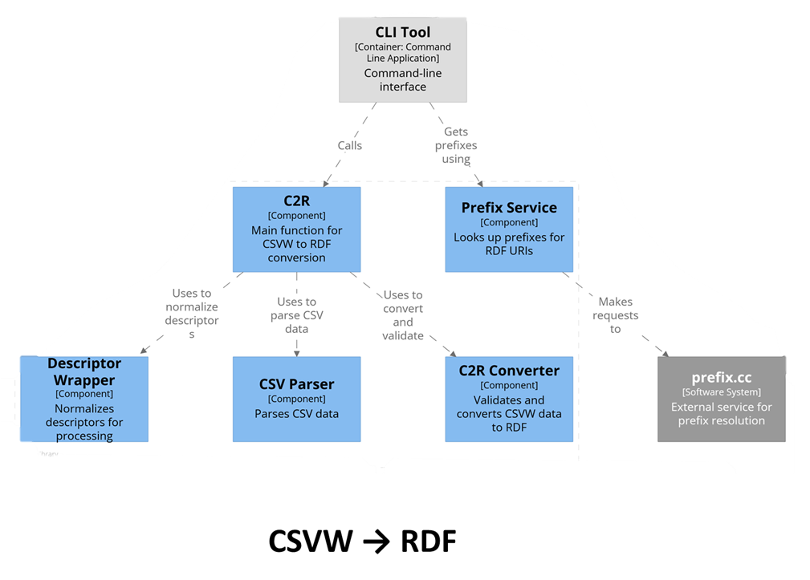

# Developer Documentation: @csvw-rdf-convertor/core

## Overview

`@csvw-rdf-convertor/core` is the foundational library for all CSVW ↔ RDF conversion and validation in the CSVW-RDF-Convertor monorepo. It provides a robust, streaming, and standards-compliant API for programmatic use in Node.js, browser, CLI, webapp, VS Code extension, and web service environments.

## Architecture

### Layered Design

- **Core Layer (`@csvw-rdf-convertor/core`)**
  - Implements all conversion, validation, and schema inference logic
  - Exposes a clean, async/streaming TypeScript API
  - Contains no UI or environment-specific code
- **Environment Layers (CLI, Webapp, VS Code, WS)**
  - Import and use the core API for their specific workflows
  - Add UI, command, or HTTP interfaces as needed

### Bidirectional Modular Architecture

The core is designed for true bidirectional conversion between CSVW and RDF. Each direction is implemented in its own set of modules, with clear separation of concerns:

- **CSVW → RDF**
  - All logic for converting CSVW metadata and CSV files to RDF is contained in the `csvw2rdf` modules 
  - Public API: `csvwDescriptorToRdf`, `csvUrlToRdf`, and related validation functions
  - Handles parsing, normalization, and streaming of CSVW data into RDFJS quads
  

- **RDF → CSVW**
  - All logic for converting RDF quads to CSVW-compliant tables and metadata is in the `rdf2csvw` modules 
  - Public API: `rdfToCsvw`, `rdfToTableSchema`
  - Handles schema inference, table generation, and streaming output

This separation allows for independent evolution, testing, and extension of each direction. Both directions share common utilities (types, streaming, validation) but are otherwise decoupled, making the core flexible and maintainable.

### Key Architectural Principles
All business logic is in the core. UI and orchestration are in environment packages.
All conversions are streaming/async for scalability.
New environments can be added by consuming the core API.
Written in TypeScript with full type definitions.

## Main Concepts

### 1. Bidirectional Conversion
- **CSVW → RDF**: Convert CSVW metadata and CSV files to RDF quads
- **RDF → CSVW**: Convert RDF quads to CSVW-compliant tables and metadata
- **Validation**: Validate CSVW metadata and data against the W3C spec

### 2. Streaming API
- All main functions operate on streams (RDFJS `Stream<Quad>`, Node.js streams)
- Suitable for large datasets and integration in pipelines


## Exposed Core API 

### Main Functions
- `csvwDescriptorToRdf(descriptor, options)`
- `csvUrlToRdf(url, options)`
- `rdfToCsvw(rdfStream, options)`
- `rdfToTableSchema(rdfStream, options)`
- `validateCsvwFromDescriptor(descriptor, options)`
- `validateCsvwFromUrl(url, options)`

### Options
- All resource loading (CSV, JSON-LD, RDF, .well-known/csvm) is customizable via function options
- Logging, path overrides, and caching are supported

### Types
- All major types (descriptors, options, issues, etc.) are exported for use in TypeScript projects

## Usage Patterns

- **Direct Use**: Import and use in your own Node.js/TypeScript project for custom conversion workflows
- **Integration**: Use as the backend for a webapp, extension, or service
- **Extending**: Add new resource loaders, logging, or error handling by extending the options

## Example: 

```typescript
import { csvwDescriptorToRdf, Csvw2RdfOptions } from '@csvw-rdf-convertor/core';

const descriptor = { /* ... */ };
const options: Csvw2RdfOptions = getC2Roptions(); //your function to create options object
const rdfStream = csvwDescriptorToRdf(descriptor, options);
for await (const quad of rdfStream) {
  // process quads
}
```

## For More Information
- See the [README.md](./README.md) for user-facing documentation
- See the [API documentation](https://s0ft1.github.io/CSVW-RDF-convertor/) for full function/type details 

---

*If you have questions about extending or integrating the core, please ask!*
